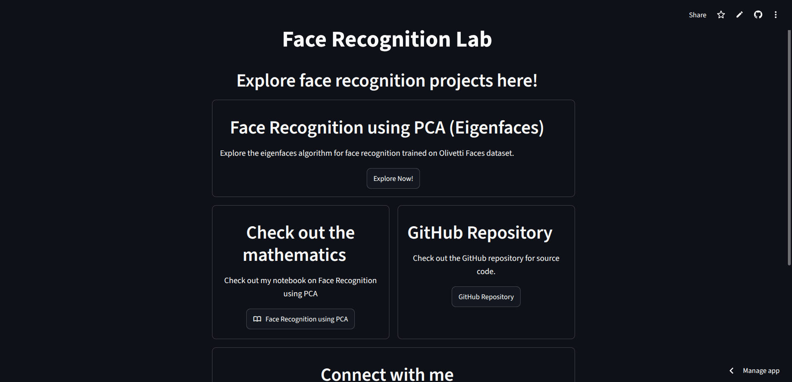
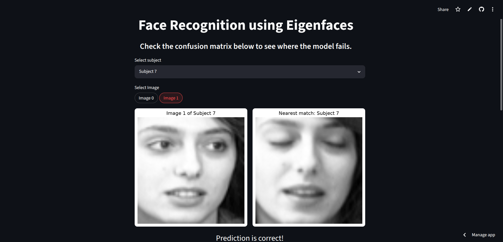
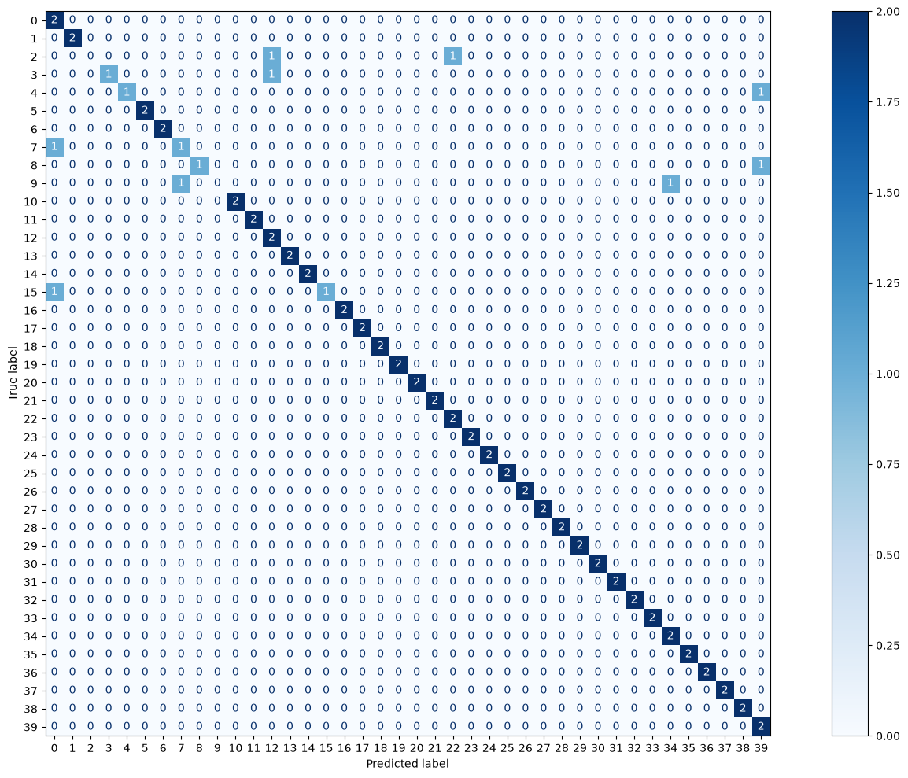
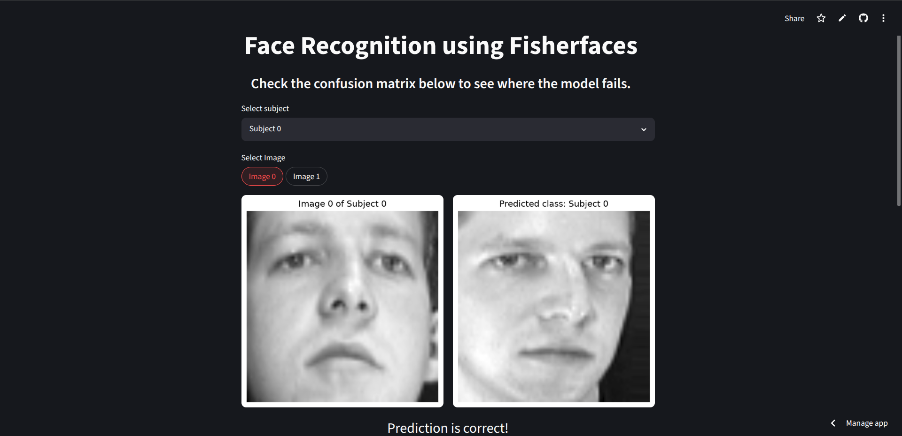
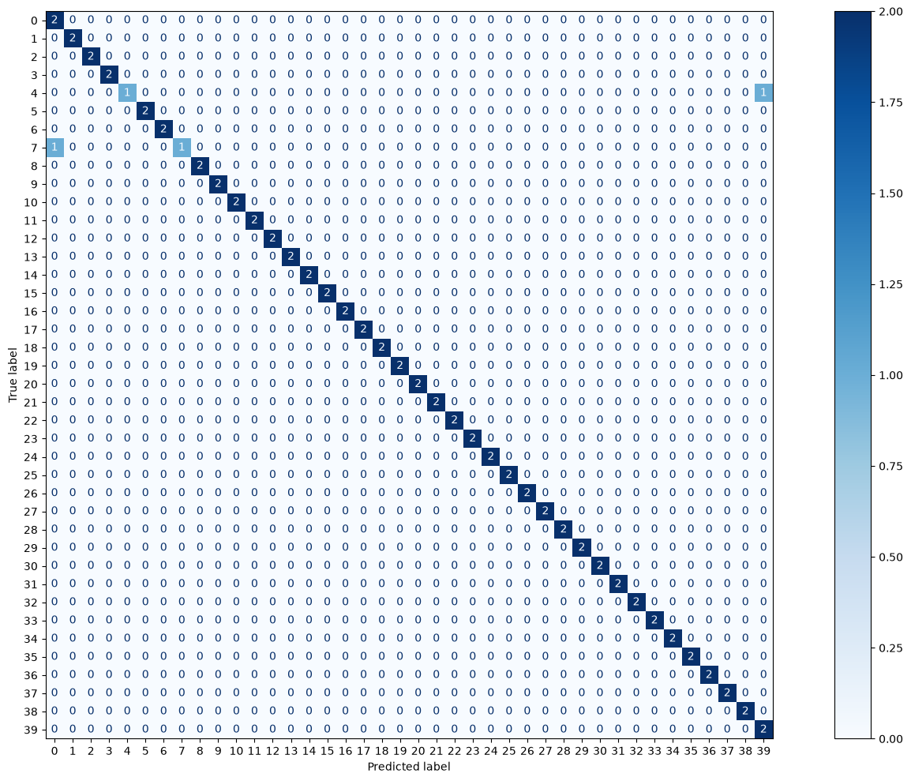

# Face Recognition

This repository is a comparative playground for face recognition algorithms, not a single-method implementation. It started with PCA (eigenfaces) and now includes LDA (Fisherfaces) on the same dataset, so classical approaches can be studied side by side.

More methods will be added over time, making it easier to trace the progression from baseline eigenfaces to discriminative and (eventually) modern methods.

## Results
Landing Page of [Face Recognition Lab](https://face-recognition-lab.streamlit.app)


### PCA model

Screenshots from [Face Recognition Lab](https://face-recognition-lab.streamlit.app)


Confusion matrix


### LDA model

Screenshots from [Face Recognition Lab](https://face-recognition-lab.streamlit.app)


Confusion matrix

## Project Overview

- `analysis/face_recognition_using_PCA.ipynb`: A notebook walkthrough covering PCA, eigenfaces, training, matching, and evaluation on the Olivetti Faces dataset.
- `analysis/face_recognition_using_LDA.ipynb`: A notebook walkthrough covering LDA/Fisherfaces and its relationship to PCA on the same dataset.
- `PCA/train.py`: Trains the PCA model on the Olivetti training split and exports the trained model.
- `PCA/test.py`: Loads the exported PCA model and finds the closest training face for a selected test image.
- `LDA/train.py`: Trains a PCA+LDA pipeline for Fisherfaces-style classification.
- `LDA/test.py`: Loads the trained Fisherfaces model and evaluates a selected test image.
- `LDA/linear_discriminant_analysis.py`: A from-scratch implementation of Linear Discriminant Analysis used as a reference/classical implementation.
- `web_app/landing_page.py`: Streamlit landing page that routes to the available face-recognition demos and related links.
- `web_app/pages/pca.py`: Interactive PCA demo for choosing a subject, viewing the test image, and checking the nearest match.
- `web_app/pages/lda.py`: Interactive Fisherfaces demo for comparing predictions and inspecting confusion patterns.
- `web_app/assets/models/pca/pca.pkl`: Serialized PCA model and projected training vectors used by the web app.
- `web_app/assets/models/lda/lda.pkl`: Serialized LDA/Fisherfaces model used by the app.
- `web_app/assets/models/pca/confusion_matrix.png`: Pre-rendered PCA confusion matrix.
- `web_app/assets/models/lda/confusion_matrix.png`: Pre-rendered LDA confusion matrix.
- `web_app/assets/datasets/olivetti_faces_dataset.npz`: Cached train/test split used by the app.
- `utils.py`: Shared constants for image shape, dataset size, and model configuration.<br>
More detailed READMEs are provided in each directory.

The current flow uses the Olivetti Faces dataset, which contains 40 subjects with 10 grayscale images each at 64 x 64 pixels. This project is intentionally structured as a face-recognition lab: PCA serves as the baseline workflow, LDA/Fisherfaces offers a complementary discriminative approach, and the repository is open to adding more algorithms in the future. The emphasis is on comparison, learning, and experimentation across methods rather than optimizing around one model alone.

## Repository Structure

Project directory structure:

```text
.
├── .gitignore
├── .python-version
├── LDA/
│   ├── __init__.py
│   ├── linear_discriminant_analysis.py
│   ├── test.py
│   ├── train.py
│   └── README.md
├── PCA/
│   ├── README.md
│   ├── test.py
│   └── train.py
├── analysis/
│   ├── README.md
│   ├── face_recognition_using_LDA.ipynb
│   └── face_recognition_using_PCA.ipynb
├── readme_assets/
│   ├── landing_page_screenshot.png
│   └── pca_screenshot.png
├── README.md
├── pyproject.toml
├── requirements.txt
├── utils.py
├── uv.lock
└── web_app/
    ├── README.md
    ├── .streamlit/
    │   └── config.toml
    ├── assets/
    │   ├── datasets/
    │   │   └── olivetti_faces_dataset.npz
    │   └── models/
    │       ├── lda/
    │       │   ├── confusion_matrix.png
    │       │   └── lda.pkl
    │       └── pca/
    │           ├── confusion_matrix.png
    │           └── pca.pkl
    ├── landing_page.py
    └── pages/
        ├── lda.py
        └── pca.py
```

- `PCA/`: Training and test scripts for the eigenfaces workflow.
- `LDA/`: Fisherfaces / Linear Discriminant Analysis experiments and scripts.
- `analysis/`: Notebook-based documentation and experimentation.
- `web_app/`: Streamlit interface, cached dataset, and saved model artifacts.
- Root files: Project metadata, dependency definitions, shared constants, and repository config.

## Dependencies

- `numpy`: Array processing.
- `matplotlib`: Visualizing faces, eigenfaces, evaluation plots, and confusion matrices.
- `scikit-learn`: Olivetti dataset loading, PCA, LDA, and metrics.
- `scipy`: Additional linear algebra utilities used in the custom LDA implementation.
- `streamlit`: Interactive demo UI.
- `jupyterlab`: Notebook exploration.

## Usage

### Clone this directory

```bash
git clone https://github.com/OjasRane/Face-Recognition.git
cd Face-Recognition
```

## Running this project:

### Using uv (Recommended):

Install uv if needed by visiting [uv installation guide](https://docs.astral.sh/uv/getting-started/installation/)

Run the following command to create a virtual environment and install dependencies.

```bash
uv sync
```

### Using pip:

#### Creating and activating virtual environment

For Windows:
```ps1
python -m venv venv
venv\Scripts\Activate.ps1
```

For MacOS/Linux:
```bash
python3 -m venv venv
source venv/bin/activate
```

#### Install dependencies

```bash
pip install -e .
```

### Run the notebook

Open the notebook in `analysis/` in JupyterLab or VS Code and run the cells top to bottom.

### Train the PCA model

```bash
# Using uv
uv run PCA\train.py     # For Windows
uv run PCA/train.py     # For Linux/MacOS

# Using pip
python PCA\train.py     # For Windows
python3 PCA/train.py    # For Linux/MacOS
```

This exports a trained model artifact for use in the PCA workflow.

### Test a single PCA face match

```bash
# Using uv
uv run PCA\test.py  # For Windows
uv run PCA/test.py  # For Linux/MacOS

# Using pip
python PCA\test.py  # For Windows
python3 PCA/test.py # For Linux/MacOS
```

Enter a test index between 0 and 79 when prompted.

### Train the LDA/Fisherfaces model

```bash
# Using uv
uv run LDA\train.py     # For Windows
uv run LDA/train.py     # For Linux/MacOS

# Using pip
python LDA\train.py     # For Windows
python3 LDA/train.py    # For Linux/MacOS
```

### Test a single LDA face match

```bash
# Using uv
uv run LDA\test.py  # For Windows
uv run LDA/test.py  # For Linux/MacOS

# Using pip
python LDA\test.py  # For Windows
python3 LDA/test.py # For Linux/MacOS
```

### Launch the web app

Run the Streamlit app from the project root directory so the page routing and asset paths resolve correctly:

```bash
# Using uv
uv run streamlit run web_app\landing_page.py    # For Windows
uv run streamlit run web_app/landing_page.py    # For Linux/MacOS

# Using pip
streamlit run web_app\landing_page.py   # For Windows
streamlit run web_app/landing_page.py   # For Linux/MacOS
```

## Notes

- PCA is effective here because the dataset is aligned and controlled, but it still captures variance rather than identity directly.
- LDA/Fisherfaces is included as a complementary classical method, which often performs well when class separation is important.
- This project uses `sklearn.decomposition.PCA` for the main workflow, and the custom LDA implementation is available in `LDA/linear_discriminant_analysis.py` for reference.
- The notebook is the best place to see how these approaches behave across matching and failure cases.
- The app relies on the precomputed assets in `web_app/assets/` so it can run without retraining first.

## Usage of AI

- All modules have code written entirely by me.
- AI was used for better understanding of the concepts.
- Drafts for READMEs were generated by AI and were modified by me for better explanation.

## Live Demo

[GitHub Pages](https://ojasrane.github.io/Face-Recognition)

[Face Recognition Lab](https://face-recognition-lab.streamlit.app)